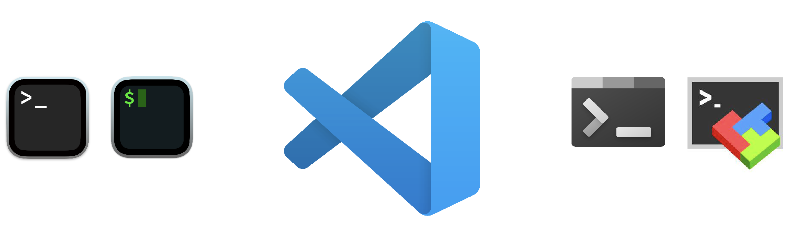
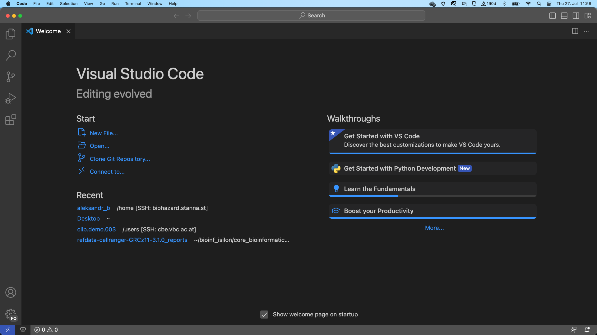
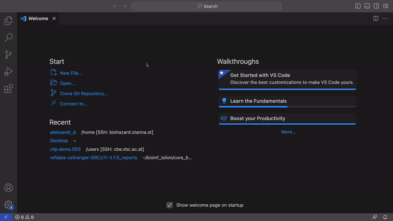
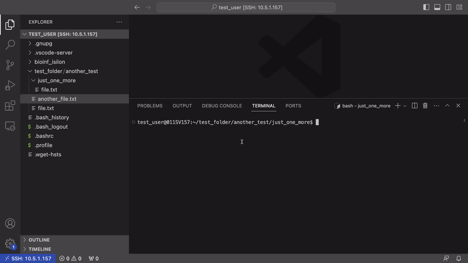

# What this tutorial is about

#draft - rewrite it later

Hi dear scientist! We are glad to see that you decided to go on the road to an adventure in computational biology. We want you to not get lost, and give you some tips and tricks on how to use the cluster and what are the best practices we are trying to use to keep our work organized.

We believe that standardization of work processes is good for reproducibility in data science and make it much easier to collaborate on projects.

Here, in the next hour or two, you will learn how to keep your data organized and structured, so that if you leave, your colleagues could continue working on your project without any delays. We believe that the best way to learn it is actually just to try to do it. That is why this tutorial is designed in a way, that you do a small project - RNA-seq analysis. Even if you are not particularly interested in this specific type of data, it serves as a good example and we can demonstrate different aspects of data and environment management, organization of work, and so on. At the same time, we try to split the whole process into independent sections, one covering one particular aspect of the work so that it would be easier to search for a particular piece of information.

So, you want to connect to the cluster to run RStudio, or process your NGS data, how do you do that? Let's set up your machine first.

# Essentials

Here we will cover the very basic topics such as setting up the IDE, connecting to a server, basic Linux commands, and some tips on how to keep your project organized.

## Setting up the machine.

{width="678"}

There are different ways to access and work on an HPC cluster. For instance, macOS users have pre-installed Terminal on their systems. Another very popular solution - iTerm2. For Windows users, there are Windows Terminal or mobaXterm. But luckily it doesn't matter so much whether you have Windows or Mac, we recommend using VS Code, as a most simple and reliable tool.

The first step - [download the VS C](https://code.visualstudio.com/)ode, install, and run it. It will look something like this

{width="693"}

On the left panel you can see several tabs:

-   Explorer - allows you to navigate in your working space, and observe files and folders

-   Search - Search in documents

-   Source control - gives you control over a git repository. We will cover that later

-   Run And Debug - gives you the possibility to use automated debugging. We don't need it for now

-   Extensions - the main beauty of VS Code. Allows to install different modules that extend the capabilities of the IDE

-   Profile - allows you to connect your GitHub account and synchronize settings across different devices

-   Settings - settings and more ;)

If VS Code is new to you, we recommend having a look at the guides that VS Code offers to check: "Get Started with VS Code" and "Learn the Fundamentals". Also, the [official guides from Microsoft](https://code.visualstudio.com/docs/introvideos/basics) are really good.

Before we begin, we need to do a couple of adjustments to the VS Code, so that it works well with a cluster. This is **important**, please **don't skip** this step.

First, we will deactivate FileWatcher - this is a plugin that is constantly checking if files are changed in an open directory. This is convenient, but if you work in a folder that has many files it can load a CPU heavily. To do this follow these steps:

-   *Settings* \> *FileWatcher* \> *Add Pattern* \> add "\*"

Second, we will deactivate *TypeScript and JavaScript Language Features Support.* Sometimes it can load a CPU as well. Do the following steps:

-   *Extensions \> \@builtin TypeScript and JavaScript \> Disable \> Reload*

    

Now you need to install "*Remote - SSH*" plugging from the "*Extensions*" tab. Also, before connecting to the server, make sure that you have your account set up and Isilon storage mounted. To do that, contact BICU, we will help you. Ok, now you are ready to connect to the cluster. Follow these simple steps:

-   Click "*\>\<"* symbol in the left lower corner \> *Connect to Host* \> *+ Add New SSH Host...* Or select one that you have set up already.

-   Select the location where you want to store the config (the default is fine)

-   Then type in "ssh your_user_name\@machine_ip", where you_user_name is the name that you got from us and IP addresses:

    | Machine Name | Machine Linux Name  | IP address |
    |--------------|---------------------|------------|
    | Biodirt      | 011SV155.AD.CCRI.AT | 10.5.1.155 |
    | Biohazard    | 011SV157.AD.CCRI.AT | 10.5.1.157 |
    | Biowaste     | 011SV154.AD.CCRI.AT | 10.5.1.154 |

-   Enter your password (if it's the first time you log in to your account, then you have a generic password that you **must** change asap) and hit enter. You might be asked if you trust the connection, or if you want to

    

It doesn't look like much happened, but you are on the server. Now, let's go to the next step and have an overview of the structure of our cluster infrastructure and learn some basic Linux commands.

## Cluster structure

We have 4 different machines, available for common usage. \
DESCRIBE HERE the structure and recommendations on where to store what. Give guidelines about Raw data storage, Scratch and so on.

## Linux commands 101

Our server is a Linux machine and working with it involves a terminal and using Bash scripting language. If you have experience with Unix systems, feel free to skip this section, as it involves very basic concepts. If you never worked with it before, in the beginning, the terminal can seem to be overwhelming and feels awkward, but you will get used to it and soon will see how fast and easy you can make many things using bash. Now, let's learn basic commands that are absolutely essential. To start using the terminal press *Ctrl+Shift+\`* or *Terminal \> New Terminal* in the menu upper bar.

1.  First, let's check where we are now, by typing `pwd`The output will look like this:\
    `/home/test_user` Where `/` is a root directory, `/home` is the folder where folders of all users are stored, and `/you_user_name` - is your home folder.

2.  Now, let's check what we have in our folder by typing `ls` Now we don't have much in our folder, but you should have Isilon storage mounted, so you should see it in the output:\
    `bioinf_isilon`

3.  But this is not everything, there are also hidden files. If you want to see them, try:\
    `ls -a`\
    you will see a bunch of files like these: *.bashrc, .profile, .bash_logout,* etc. Files starting with a dot are hidden by default.

4.  When you will have a lot of files, it becomes more practical to visualize them as a list. To do that use\
    `ls -lh`\
    `-l` stands for "list" and `-h` for *"Human-readable"*, so the size of the files is depicted as Mb, Gb, Kb, which is easier to read.

5.  Ok, now we can peek at what we have in the bioinf_isilon directory:\
    `ls bioinf_isilon/`\
    We will see several folders:\
    `core_bioinformatics_unit  Labdia  _OLD-TEST  Research  zArchive  zClipboard  zrawdata`

6.  Great, now let's learn how to move around. Start typing `cd` and press "*Tab*", so that the terminal does autocompletion and you could see what folders are out there. So, try to move to the folder of your group, or anywhere really:\
    `cd bioing_isilon/Research/YOUR_GROUP/Public`

7.  If you want to move to a folder above, you can use `cd ../`\
    To a previous location use `cd -`\
    To come back to your home directory please just type `cd ~`\
    One important thing to remember is that in comparison to Windows, Linux is case-sensitive, so `Research`, `research`, `RESEARCH` and `ReSeArCh` are all different names.

    

Great! Now we are able to move around and see what we have in different directories. Now let's try to create files, and directories, rename, copy, cut, and delete them.

4.  Ok, assuming that you are in your home directory, let's create a new folder, using this command:

    `mkdir test_folder`\
    Check that the folder is there, with `ls` One important note - it's generally a good idea to avoid using special characters and spaces in the names of directories and files. It's still possible, but you would need to use escape characters and it makes everything much more cumbersome. So, try to avoid it.

5.  It's also possible to create several folders inside one another. This, you need to use the parameter `-p` Let's do it and move there\
    `mkdir -p test_folder/another_test/just_one_more`\
    `cd test_folder/another_test/just_one_more`

6.  Atm, it feels a bit empty, so let's create a file inside. You can do it in several ways, for example, you can use this command:\
    `touch file.txt`

    FYI it's also possible to do it using GUI in the VS Code. To do that, click in the left panel *Explorer \> Open Folder \> Ok.* You will see a tree of files and buttons "Create file", "Create Folder" and "Refresh".

7.  When you created the file, let's write something inside. There are countless ways to do that, but assuming you have the "*Explorer*" open, find the file, open it, and write something inside.\
    

8.  To observe the content of a file we typically use the following commands:\
    `less file.txt` - allows look at the whole file. Navigation by arrows, and space bar. To exit press `q`*\
    *`head file.txt` - allows looking at the first 10, or n rows\
    `tail file.txt` - the same, but for the last rows

9.  Now, let's try to copy files using:\
    `cp file.txt ../`\
    we specify first what we want to copy, then the destination. If you want to change the original name of the file, just specify the new name at the end:\
    `cp file.txt ../file_copy.txt`\
    \
    Moving and renaming works very similarly - use:\
    `mv ../file_copy.txt ../file_with_new_name.txt`

10. Now, let's try to remove the [[file:\\\\](file:){.uri}](%5Bfile:%5D(file:)%7B.uri%7D){.uri} `rm file.txt`\
    \
    **Important note** - rm removes the file permanently. There is no such a thing as "trash bin". So, be very careful with what you are removing.

11. Now let's try to remove the folder that we created. First move to the home directory. Then, we need to use `-r` parameter:\
    \
    `rm -r test_folder`

    

So, now we know how to create files and folders, rename them, copy and delete. Also, remember that you can do it in the GUI, but sometimes it can be easier to do with CLI. In principle, these are the most commonly used commands that you really need to remember. There are also others that you could find in [the cheat sheet](https://cheatography.com/davechild/cheat-sheets/linux-command-line/).

There are also several nice tutorials some of which are here:\
[Link #1](https://rnabio.org/module-00-setup/0000/08/01/Unix/)

## Managing your environments with Conda

One of the most important practices in bioinformatics work (probably in a wet lab it's even more important) is making your work easily reproducible. So, it's crucial to know what packages and what versions of them you are using, and properly record this information. And as many packages might have many dependencies, proper management of it is crucial, so that your project would not turn into a spaghetti monster.

There are different solutions out there and one of the most popular ones is [Conda](https://docs.conda.io/en/latest/) package manager, or its sister [Mamba](https://mamba.readthedocs.io/en/latest/#). They allow you to install packages of specific versions and easily create virtual environments for a project when you need them. To install Mamaba use this line of code while being in your home directory.

`wget "https://github.com/conda-forge/miniforge/releases/latest/download/Mambaforge-$(uname)-$(uname -m).sh"`

`bash Mambaforge-$(uname)-$(uname -m).sh`

Don't forget to reload the terminal, so that mamba gets activated.

After installation, you have a very convenient way to control what to install and how. Now you are in your default (base) environment - it's a good idea to store here the tools that you are going to use on a daily basis. And for specific projects, it makes sense sometimes to create separate environments. You will see how it works in the following sections of the tutorial. But first, we will install a couple of packages that are absolute must-haves.

First, let's install tmux. This is a terminal multiplexer that allows you to create different sessions, that you can switch between easily and that will run your commands even when you get disconnected from a cluster. To do that, use this simple line of code:

`mamba install tmux`

When the installation is complete, type in `tmux` in the terminal to start a session. Now you can see that not many things changed at first glance, but in reality, now we have a separate tmux process running and if we start some pipeline that will take let's say 5 hours to complete it won't crush if we get disconnected from the server. Also, we can easily create, switch windows and tabs just like in a normal web browser.

For instance, we can split the window into two panes. But first, a small note about the controls in tmux. All commands in tmux are triggered by a **prefix key** followed by a **command key**. By default, tmux uses `Ctrl+b` as a prefix key (often labeled as `C-b`). It can feel weird at the beginning, but you will get used to it very fast.

So, if you want to split the screen into left and right, press `Ctrl+b`, release, then press `%`. To switch between them use `C-b <arrow key>`. Great! So, this is very convenient when you want to have several terminals open, but want it to be nicely organized. Now let's see the true beauty of the tmux.

Let's run a very simple code that will just show us the date and time every 3 seconds until we stop it:\
`while true; do 'date'; sleep 3; done`

Now, if we detach from the current tmux session using `C-b d` We went to just a regular terminal, let's connect to the running session. To do that, we need to know the name of the session. let's check it with:\
`tmux ls`\
You should see only one session with the name "0". To connect to it use:\
`tmux a -t 0`

And boom, you are back! And you can notice that the session was active - there are more dates printed (to stop the running process press `Ctrl+C)`. So, it might not seem like something extraordinary, but by default normal terminals stop processes associated with them when ssh tunnel is closed. So, if you started your precious script, went to make a coffee and your computer went to sleep in the meantime, the ssh tunnel breaks and your script gets stopped. So, tmux creates constantly running processes. Also, if you work on several projects it is very practical to have separate sessions, for each individual project. It helps to keep everything organized.

And before we go to the next section, here are more handy commands:\
`C-b x` - close the current pane\
`C-b "` - horizontal split\
`C-b w` - show all windows

Also, here you can find some really good tutorials if you want to deep dive into the tmux:

-   [A Short and simple introduction](https://www.hamvocke.com/blog/a-quick-and-easy-guide-to-tmux/)

-   [How to customize tmux](https://www.hamvocke.com/blog/a-guide-to-customizing-your-tmux-conf/?__proto__.e32a5ec9c99=ddcb362f1d60)

-   [Cheat Sheet](https://tmuxcheatsheet.com/)

So, now we are fully prepared for creating our first project and see what is the best way to keep the work organized and trackable.

## Creating a project

Now we can simulate a typical project and show what could be a convenient way to organize your workflow. In this particular example, we will try to analyze RNA-seq data. You will see how to organize folder structure in a convenient way, and how to manage big data versions and your code. You will see how the usage of the Conda environment can be beneficial and we will show how how to share this information with your potential collaborators. Also, you will see how to run RStudio in a container.

### Folder structure setup

First, we need to create a folder where we will locate the project. We would suggest you to create a folder in your research group folder if you still don't have one. It makes life much easier for your colleagues if they deice to pick up your project when you leave, or re-analyze some data after a long time. A typical path would look like this:

`/home/USER/bioinf_isilion/Research/GROUP/USER/projects/ID000_YYYYMM_ProjectName`

The name of the project folder would contain the following information `ID000` - your ID (for example I use AB as an acronym of my name and surname), followed by a number in the format `001, 002, …` It's quite convenient to give each project a unique index so that it would be easier for you to search it.\
`YYYYMM` - date in the format YEAR, month. The year goes first because when folders are arranged by year first, it becomes easy to sort them.\
`ProjectName` - just a short description of what this project is, eg. Neuroblastoma_RNAseq

A typical directories structure would look like this:\
`ID000_YYYYMM_ProjectName/`

`├─ RProject/                              - folder where you will store your Rproject`

`│  ├─ Results/                            - Results that you will produce with R code`

`│  ├─ Misc/                               - maybe you have some important metadata for R`

`├─ Data_Raw/                              - Here it's either RAW data, or a symlink to it`

`│  ├─ 01_Sample/`

`│  ├─ 02_Sample/`

`├─ Data_processed/                         - In some cases you can produce intermediate files`

`├─ Src/                                   - You scripts for data processing`

`│  ├─ 01_DataProcessingScript.sh`

`│  ├─ 02_AnotherDataProcessingStep.sh`

`├─ Misc/                                  - Additional data, eg. references, metadata, etc.`

`├─ .gitignore                             - part of your git repo`

`├─ README.md                              - it's nice to have a short description of a project`

Of course, it's not a strict rule that you always must have such a structure. No. It's just an idea of how it might look like. Just keep it clean and self-explanatory, or add a very good description of what is what. Make your, or a colleague's life who will use your code after you easier.

### Loading the data

So, move to a directory of your group and try to create a project folder, and inside `Data_Raw`, `Src` and `Misc` folders. When this is done, let's pull a test dataset. For this, move to `Src` and create a file `00_DataLoader.sh` We will work with an example dataset - RNA-seq data from human.\
Open the created file and write there this code:

`#!/bin/bash`

`wget http://genomedata.org/rnaseq-tutorial/HBR_UHR_ERCC_ds_5pc.tar -O ../Data_Raw/HBR_UHR_ERCC_ds_5pc.tar`

`tar -xvf ../Data_Raw/HBR_UHR_ERCC_ds_5pc.tar -C ../Data_Raw/`

`rm ../Data_Raw/HBR_UHR_ERCC_ds_5pc.tar`

Save the file, and execute it from the `Src` folder with:

`bash ./00_DataLoader.sh`

Great! If everything went well, then you should have a Data_Raw folder with 12 fastq files.

### Version control Git and DVC

Now, when we created the structure and populated our folder it's a good time to give some basic ideas on how to keep track of changes that you make to your code, data, and so on. We will use 2 packages for this - git and dvc. Try to install them using mamba. They are general-use packages, so we will install them in our base environment. The command should look like this:

`mamba install git dvc`

Git is an open-source system that allows users to easily control the changes that happen to the code and see the history of these changes. It's very widely used and we highly encourage you to implement it in your workflow. If you want to make changes to your code, you don't want to create a backup every single time - it consumes a lot of hard drive space and becomes cumbersome to know what exactly you did and when. So, Git allows you to create different branches, switch between them, merge them, and easily "go back in time" to see what changes were made to the code, when, and by whom.

Another system that we are going to use is DVC - this is very similar to Git, but it is designed specifically for large data because Git can have a hard time sometimes keeping track of changes to several TB of NGS data that you might have. In this tutorial, we are going to cover only the very basics, but if you are interested, you are more than welcome to explore other tutorials.

So, we will start with initializing out git repository. make sure that you are located in `…/ID000_YYYYMM_ProjectName/` and then type in the following command:

`git init`

So, you created a git repository! You can see that you have a new hidden folder .git which will contain information about changes that you do to your files in this folder. It's not done automatically, so you need to do it manually, but first, let's create a file where we will specify what folders and files we don't want to track. Create a file `.gitignore` and populate it with the following:

`Data_Raw`

`*.fastq`

So, we just specify in this file what should be ignored by Git. We specifically want to ignore raw data, because we will track it with DVC. Actually, DVC does it automatically, but we would like to demonstrate how to use this functionality. And to initialize DVC tracking, you need to do similar steps:

`dvc init`

And then:

`dvc add Data_Raw`

This will create a `Data_Raw.dvc` file, that is specifically linked to this folder, so that Git will track not the raw, big files themselves, but a small file, linked to this folder.

You may ask - "It looks quite complicated! Why do we need to use DVC? Isn't Git just enough?" Well. if theory, you can use only Git, but every time you would like to record your changes, Git will start checking that every single file hasn't been changed. And it's totally fine if your project is not bigger than a couple of Mb, but if you have hundreds of Gb of data, or you have hundreds of thousands of small files, it will take an eternity to stage your project. Another reason is that if you decide to publish your code to a GitHub, or similar resource, they usually have very strict limitations on a size of a repository. And if you have a long history of changes in your Git, with recorded information about big files, removing this information from commits is no fun. So, it's easier to follow a good practice from the very beginning. Another big advantage is that if you let's say developed your data analysis pipeline and want to test how it performs on different sets of data, it's much easier to simply switch between different versions of data using DVC, rather than editing your script, or creating multiple versions of a data folder.

Now, when we have our data tracked with DVC, we can do our first record to Git - commit. First, let's check the status, using this command:

`git status`

You should get a brief summary of what changes were made to files (added, deleted, changed). Then, you need to specify what files to stage, or alternatively, just stage everything with:

`git add .`

*"."* in this case, mean adding everything. And then, you can commit these changes using:

`git commit -m "write here a very short summary of what you did. Let's say Initial commit"`

You can also do these operations also using GUI (remember that button on the left for version control?). For this first, you need to open the repository. Press Ctrl+Alt+P - this will open a panel (which is a very cool tool by itself, but it would go beyond the scope of this tutorial) and type it Git: Open Repository Navigate to the folder of this repository and hit enter. Now, on the version control panel, you should see your git repository open and you can see what changes were made to the files, stage them, commit, push, pull, and many other operations. Also, we can recommend installing an extension "Git graph" which expands the functionality of the default tool.

Try to do commits from time to time. Let's say daily, or when you finish a specific part of the work. It's generally a good idea to commit a working code, as it will save a ton of time in the future if you decide to test this specific version of code.

Of course, this is not even a percent of the functionality of Git and DVC. If we would try to describe everything it would take a whole good course. So, we encourage you to explore it on your own here are some good tutorials that you can find handy:

-   <https://git-scm.com/doc>

-   <https://dvc.org/doc>

### Data processing

Now we have our raw RNA-seq data and we can try to process it. We need to assess the quality of reads, filter them, align them to a genome, basically do the pre-processing, and get a gene count table. To do this we are going to use the [NextFlow](https://www.nextflow.io/) framework and [RNA-seq pipeline developed by nf-core](https://nf-co.re/rnaseq/3.12.0). The advantage of this approach is the ease of installation of the pipeline, portability, and great community support.
