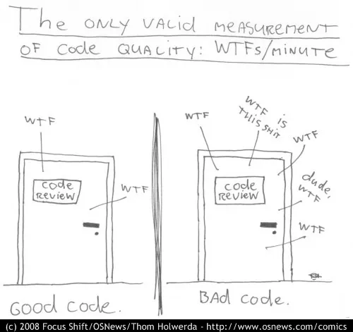

# Best Coding Practices Guidelines

- Writing good code matters - it is better for you, your colleagues, and your collaborators
    - This doesn't only apply when it comes to the [Code Review](./code_review.md) but to the overall code quality



## General Best Practices

- **Standards** are useful - stick to the best practices and [Code Styling](#code-styling)
    - This makes your code faster to read and easier to modify for both the future you and everyone else
- Use **functions** wherever possible and reuse them
    - They lower the chance of making a typo error when reusing the code in multiple sections
	- Functions are not only about code repetition - functions can be [Unit Tested](./code_testing.md#unit-tests)
- Use **configs** wherever possible
    - Try to avoid settings parameters and variables, especially the repeating ones, directly in the scripts
    - For example, you can use `YAML`-based config files and parse them [`yq`](https://github.com/mikefarah/yq) inside your shell scripts (see an [example](#parsing-config-files-with-yq) below)
    - You can also use a simple `config.sh` file with common variables assignment and `source config.sh` from within your shell scripts
- Choose **one version** of your development environment - R, Python, other programming languages, software tools, and base Docker image, and use them as much as possible
    - This makes it easier to reuse code in your other projects or by your colleagues
- **Minimize the use of comments** in the code - Let the code speak for itself by choosing proper variable and function names
    - Notes worth keeping could be included in the README or NOTES, not in the code
    - Avoid unexplained commented *run* code in the scripts
- **Don't keep unused code**
    - Keep only used and relevant code relevant in the final version
    - Unnecessary code makes it harder to read, it is more difficult to maintain and draws focus away from the most important sections
- Use **`git` commit history** if you need to go back or revert changes
    - For example, one of the options is to remove the comments in one of the very last commits before the merge if you really want to keep your comments with the code. You can always go back to that commit and see them. The same applies to the unused code you want to *remember*
- Keep an **empty newline at the end** of your scripts/configs
    - Avoids possible [syntax errors](https://dev.to/documendous/why-you-should-end-your-source-files-with-a-new-line-156g) and makes it easier to `cat` the files
- **Organize your code** in one way and stick to it (see [Repository Structure](./repository_structure.md))
- **Develop in branches** and use Pull Request (Merge Request) to *publish* the code (see [GitHub Best Practices](github_best_practices.md) and [Code Review](./code_review.md))
- Try to follow the Clean Code idea as much as possible (partially covered in other sections as well):
    - [Clean Code for beginners](https://www.freecodecamp.org/news/clean-coding-for-beginners/) and [Clean Code book summary](<https://gist.github.com/wojteklu/73c6914cc446146b8b533c0988cf8d29>)
	    - The actual (for a lot more information) [Clean Code book](https://github.com/jnguyen095/clean-code/blob/master/Clean.Code.A.Handbook.of.Agile.Software.Craftsmanship.pdf)

## Naming Conventions (functions, variables, scripts)

- It is always better to be explicit than implicit
    - Don't expect other people to understand the code the same way as you know it - make it obvious
- Keep [naming clean and easy to understand](https://medium.com/coding-skills/clean-code-101-meaningful-names-and-functions-bf450456d90c)
    - Name the functions based on what they do
    - Name the variables based on what information they hold
    - Name the scripts based on what they run
- Use the correct naming style based on the language and type of object:
    - **Snake Case**: Words are separated by underscores, and all letters are usually lowercase (e.g., `user_id`, `first_name`) - used for variables. There's also a variant called "screaming snake case" where all letters are uppercase (e.g., `USER_ID`) - used for constants (~global variables). Commonly used in: Python and shell scripting.
    - **Camel Case**: The first word is lowercase, and each subsequent word starts with an uppercase letter (e.g., `userId`, `firstName`). Commonly used in: Java and C++ for variable and function names.
    - **Pascal Case**: Similar to camelCase, but the first letter of each word is capitalized, including the first word (e.g., `UserId`, `FirstName`). Commonly used in Java and C++ for class names and sometimes for method names.
    - **Kebab Case**: Words are separated by hyphens, and all letters are lowercase (e.g., `user-id`, `first-name`). It is not very common except for URLs for CSS class names and HTML IDs.

## Code Styling

- Everybody has a different *coding style* - code structure and aesthetics
- To avoid unnecessary confusion and possible conflicts, we follow certain code styling guidelines

### Shell

- [Shell code styling practices from Google](https://google.github.io/styleguide/shellguide.html)​
- Additional best practices [here](https://medium.com/codecuriosity/shell-script-best-practices-048696404b3a) (PDF version [here](./examples/Shell_Script_Best_Practices_Neuro_Bytes_CodeCuriosity_Oct,_2024_Medium.pdf))
- Another nice (and short) summary [here](https://bertvv.github.io/cheat-sheets/Bash.html)​
- Set `set -ueo pipefail` on the top of your bash scripts to capture unset variables, error codes, etc.
	- Description of the used flags [here](https://gist.github.com/mohanpedala/1e2ff5661761d3abd0385e8223e16425#file-bash_strict_mode-md)
- Quote variables to prevent word-splitting
- Don't put passwords and
- Use `#!/bin/bash -x` or `#!/bin/bash -v` for debugging
    - Note: You can also use `bash -x my_script.sh` or `bash -c my_script.sh` to run the scripts to get the same outcome

### R

- We follow [tidyverse style guide](https://style.tidyverse.org/)​
    - [R code styling practices from Google](https://google.github.io/styleguide/Rguide.html) are not as descriptive as for shell but still helpful

### Python

- We follow [PEP 8 code formatting](https://peps.python.org/pep-0008/) - widely accepted and the industry standard
    - Note: `black` with `isort` we use for code styling (see below) follow [PEP 8 formatting](https://github.com/psf/black?tab=readme-ov-file#the-black-code-style) (see code formatting below)

### Markdown

- We follow [Markdown guide](https://www.markdownguide.org/basic-syntax/)

### Docker

- We follow [Docker Best practices](https://docs.docker.com/build/building/best-practices/)

## Code Formatters and Linters

- Code [**Formatters**](#code-formatters) help us with code formatting checks or even with autoformatting
- Code **[Linters](#code-linters)** are handy to analyze the code for programming errors and bugs early on

### Code Formatters

- Code **Formatters** can be utilized to format the code and unify the coding style automatically
- The most common code autoformatting options are:

1) [Code editors formatters](#code-editors-formatters)
2) [Command-line formatters](#command-line-formatters)

#### Code Editors Formatters

##### VS Code Formatters

- VS Code offers a lot of code formatters add-ins:
    - shell: [foxundermoon.shell-format](https://marketplace.visualstudio.com/items?itemName=foxundermoon.shell-format)
    - Python: [ms-python.black-formatter](https://marketplace.visualstudio.com/items?itemName=ms-python.black-formatter) together with [ms-python.isort](https://marketplace.visualstudio.com/items?itemName=ms-python.isort)
    - `snakemake`: [tfehlmann.snakefmt](https://marketplace.visualstudio.com/items?itemName=tfehlmann.snakefmt)​
    - `nextflow`; [esbenp.prettier-vscode](https://marketplace.visualstudio.com/items?itemName=esbenp.prettier-vscode); Note: `nextflow` offers VS Code extension [nextflow.nextflow](https://marketplace.visualstudio.com/items?itemName=nextflow.nextflow) for syntax highlighting, completion, and error checking (more information [here](https://nf-co.re/docs/contributing/code_editors_and_styling/code_formatting) and [here](https://nf-co.re/docs/guidelines/documentation/writing_style))
    - Markdown: [DavidAnson.vscode-markdownlint](https://marketplace.visualstudio.com/items?itemName=DavidAnson.vscode-markdownlint)​
    - Dockerfile: [ms-azuretools.vscode-docker](https://marketplace.visualstudio.com/items?itemName=ms-azuretools.vscode-docker)​
    - YAML: [redhat.vscode-yaml](https://marketplace.visualstudio.com/items?itemName=redhat.vscode-yaml)​
    - JSON: default VS Code JSON features `vscode.json-language-features`
- See the [example](#shell-code-formatting-upon-save) below on how to automate the code formatting as [git pre-commit hook](#git-pre-commit-hooks-for-code-formatting-and-linting)

##### Vim/NeoVim Code Formatters

- Some of the code formatters mentioned in the [VS Code section](#vs-code-formatters) are available for Vim/NeoVim as well

##### RStudio Formatters

- RStudio offers some code stylers as well:
    - R: [{styler}](https://styler.r-lib.org/index.html)
        - Assign a keyboard shortcut in RStudio and use it before a commit
        - Alternatively, `{styler}` can be included in [git pre-commit hook](#git-pre-commit-hooks-for-code-formatting-and-linting) using [{precommit}](https://github.com/lorenzwalthert/precommit) package

#### Command-line Formatters

- Some of the code formatters can be used from the command line, or as part of the git pre-commit hooks:
    - Python: `isort` and `black`
    - `snakemake`: [`snakefmt`](https://github.com/snakemake/snakefmt)
    - `nextflow`; [`prettier`](https://prettier.io/); more information [here](https://nf-co.re/docs/contributing/code_editors_and_styling/code_formatting#prettier)

### Code Linters

- As well as code formatters, linters can be used within the code editor, from the command line or as part of the git pre-commit hook:
    - shell: [shellcheck](https://github.com/koalaman/shellcheck)
        - Available as both command-line tool and VS Code add-in: [timonwong.shellcheck](https://marketplace.visualstudio.com/items?itemName=timonwong.shellcheck)
    - R: {[lintr](https://github.com/r-lib/lintr)}
    - `snakemake`: `snakemake --lint`; more info [here](https://snakemake.readthedocs.io/en/stable/snakefiles/best_practices.html)
    - `nextflow`: `nf-core pipelines lint`; more info [here](https://nf-co.re/docs/guidelines/pipelines/requirements/linting) and [here](https://nf-co.re/docs/nf-core-tools/pipelines/lint)
    - Markdown: [DavidAnson.vscode-markdownlint](https://marketplace.visualstudio.com/items?itemName=DavidAnson.vscode-markdownlint)

### `git pre-commit` Hooks for Code Formatting and Linting

- Automatic code formatting and linting can also be implemented as part of [git pre-commit hooks](https://www.atlassian.com/git/tutorials/git-hooks) and [here](https://git-scm.com/book/ms/v2/Customizing-Git-Git-Hooks)
- In general, `git` hooks are *processes* automatically executed upon a specific `git` command
- In this case, you can use pre-commit hooks to automatically execute code formatting and linting before the actual `git commit`
    - As a result, the code is formatted before the commit, avoiding the necessity to `--amend` the commit due to formatting inconsistencies
    - The same applies to linting
- You can set pre-commit hooks manually, but it's much easier to use [pre-commit](https://pre-commit.com/)
    - Example on how to setup pre-commit hook for `nextflow` using `prettier` [here](https://nf-co.re/docs/contributing/code_editors_and_styling/code_formatting#running-with-pre-commit)
- Note: `git pre-commit` hooks **don't** have to be applied **only** to code **formatting or linting** - you can use them for any git-related actions
- Note: Some code editors' UI git commit functionality does not fully support git hooks and you have to `--amend` or run the tools separately

## Examples

### Parsing Config Files with `yq`

- To parse config `YAML` with `yq`, simply include this in your scripts:

```yaml
name: John Doe  
age: 30  
address:  
 city: New York  
 zip: 10001
```

```bash
yq eval '.name' config.yaml  
# John Doe
```

- Note: Don't install `yq` with `conda`. `conda` only contains a very old version of `yq` (v3.4.3; current is v4.44.5). Installing it directly from [GitHub](https://github.com/mikefarah/yq?tab=readme-ov-file#install) is better.

### Python Code Formatting `git pre-commit` Hook

To autoformat Python code before `git commit`, you can do the following:

1. Install `isort` and `black`

```shell
pip3 install isort black
```

2. Save the following code into  `~/.git/hooks/pre-commit` file + add execution permissions `chmod +x ~/.git/hooks/pre-commit`.

```shell
#!/usr/bin/bash

if test -e ./.git/hooks/pre-commit; then
    bash ./.git/hooks/pre-commit
fi

isort --sl --profile black . --skip venv/
black -l 120 . --exclude venv/
sleep 1
wait
```

3. Edit `~/.gitconfig` by adding:

```shell
[core]
    hooksPath = /home/<USERNAME>/.git/hooks
```

- This will run `isort`+`black` automatically for all the Python scripts before `git commit`

### `shell` Code Formatting Upon Save

- To format shell code automatically with every file save in VS Code, you can do the following:

1. Open User settings at *Search* -> *Show and Run Commands* -> *>Preferences: Open User Settings (JSON)*
2. If you haven't changed any settings so far, this file might be empty. In that case, you have to *initiate* the JSON list with `{}`
3. Paste this for shell script autoformatting on save and to automatically use four spaces instead of tab:

```json
"[shellscript]": {
  "editor.defaultFormatter": "foxundermoon.shell-format",
  "editor.formatOnSave": true,
  "editor.detectIndentation": false,
  "editor.insertSpaces": true,
  "editor.tabSize": 4,
 -"editor.codeActionsOnSave": {
    "source.fixAll.shellcheck": "explicit"
  },
},
```
