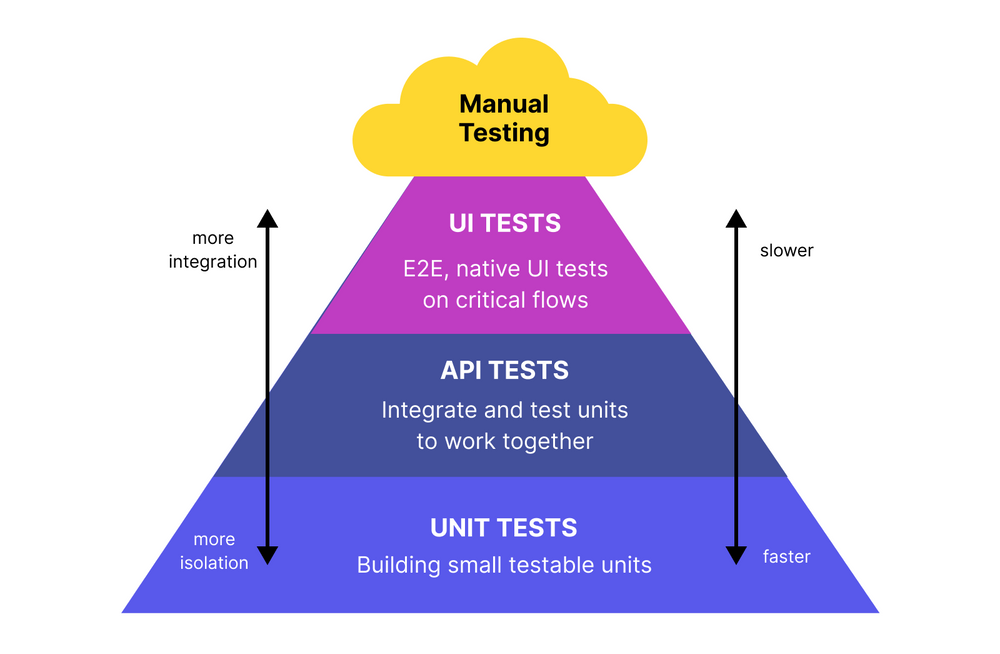

# Code Testing Guidelines

- Every code should be tested to be sure it does what it is supposed to do
- Of course, there is always a question of the code complexity - simple code with one-liners (`samtools view -h input.bam`) probably doesn't need testing as much as complex code with a bunch of custom functions
- We should not submit code for review, share it, or publish unless it's properly tested and we are confident about it
- A test should ideally be self-sufficient and self-contained
- It's more important that the test code be obvious than, e.g., as dry as possible
- There are [many different types](https://www.atlassian.com/continuous-delivery/software-testing/types-of-software-testing) of tests
- We primarily use **End-to-end tests** and **Unit tests**
    - [End-to-end tests](#end-to-end-tests) - test the code as whole -> less detailed but more intergrated
    - [Unit tests](#unit-tests) - test individual functions/parts of the code -> more detailed but less integrated
- Other types of tests we think of implementing in the future or specific cases are:
    - **Integration tests** - verify that multiple modules work together - for example, multiple pipelines working together to create one unified result.
    - **Smoke tests** - verify that the system (for example, cluster or front-end) is working as it should. These are quick tests that check for potential anomalies that can limit the system and we don't constantly track
- We also have to use **Manual testing** as part of the Code Review or for complicated environments
- Note: We cannot test every user's behavior
    - We can limit certain behaviors in the README of function input limits
    - For example, we can specify the input to the function is a `fastq` file - we do not have to test whether the input is a non-empty `fastq` file as it is not an issue of the code but of the user themselves

## Tests

### End-to-end Tests

- End-to-end tests (E2E) test the **code as whole**
    - Test if the code overall is functional and produce the expected results
- They are based on running the code with predefined test input data and comparing the expected workflow results with the actual results - this simulates the **full usage of the code**
- E2E tests are very useful but expensive to run because of the time and resources they take
    - They take longer to run because the data has to go through the whole *pipeline*
- E2E tests should be based on the smallest possible subset of the data that can still fully test the code
    - This might be problematic in the case of big projects like machine learning or for results which [do not provide deterministic](https://github.com/COMBINE-lab/salmon/issues/613#issuecomment-757989858) results
    - In that case, you should provide access to *hard to reasonably test* parts of the results and make tests for the rest of the code
- They don't go into the details, which might make it more difficult to identify the key error
- They are also useful for code sharing and deployment where we want to make sure that a *second-person* environment setup produces the same results
- Note: As E2E tests usually require bigger test files, be careful when uploading them to GitHub
    - The total GitHub repository should be ideally [smaller than 1 GB](https://docs.github.com/en/repositories/working-with-files/managing-large-files/about-large-files-on-github) (including the history)
    - If your test files are large(-ish), use [git LFS](https://docs.github.com/en/repositories/working-with-files/managing-large-files/configuring-git-large-file-storage) or [DVC](https://dvc.org/). In edge-case scenarios, you can also use local server-hosted files.
- For ongoing **development**, it's better to rely on faster, more low-level tests (like [unit tests](#unit-tests)) because they can identify and localize the problem faster
    - However, unit tests don't test the overall flow of the analysis as E2E tests do

#### End-to-end Tests Framework

- The easiest way to set and evaluate E2E tests is to use the `diff` command between the expected result and the actual result
- In some cases, you have to sort or otherwise *normalize* the results so they are truly comparable
- You can also compare the file size, text outputs, etc. - anything that can be run in the test environment (see [Where to run tests](#where-to-run-tests))

### Unit Tests

- Unit tests test individual **functions** or parts of the code
- In general, it is recommended to structure your code in functions as they can be easily tested and they make the code easier to understand
    - Don't forget to name your function properly - the same applies to [unit test functions and class names](https://docs.python.org/3.8/library/unittest.html#basic-example) (see [Practical unit tests examples](#end-to-end-tests-1) for more details)
    - Note: *class* is a group of single tests testing a single function for multiple input and output options. We don't have to use classes for all unit tests if the tested function is simple enough
- They are based on comparing the expected outputs with the actual outputs
    - The output form depends on the real function output object - string, value, data frame, array, ...
    - The input is usually *simplified* to a minimum so it can fit into the body of the test function
- Testing the individual functions can capture errors and bugs early, preventing you from building additional subsequent code based on erroneous results
    - The unit test fails if the expected and actual output disagree exactly at the moment when the code breaks
    - You immediately see where the code breaks if the test functions/classes are named properly
    - You can also see the actual output and reverse engineer what went wrong in many cases
- The tests should test both positive and negative outputs as well as capture the warning/error messages
    - **No function should fail silently** as it is impossible to correctly unit test
    - "*Test failed successfully*" but even better "*Test failed successfully because the input doesn't exist.*
- Unit tests are extremely helpful not only for your development but also for the Code Review (CR)
    - During CR, the reviewer directly sees what a particular function is doing, understands it, and can properly test it or add additional test conditions (proper test function and class naming help a lot here as well)
- Manually setting up tests for each function might take some time
    - One has to think about possible scenarios and write that in the test function
    - Luckily, most code editors have add-ins that help create unit tests, so you don't have to build everything from scratch!
        - Note: The add-ins are usually good in providing unit test *backbone* - you still have to check the suggestion and adjust it according to the *real* theoretical inputs/outputs

#### Unit Test Frameworks

- Many frameworks help with unit tests and do the comparisons automatically:
    - Python: [unittest](https://docs.python.org/3/library/unittest.html); library specific - for example [pandas unit testing](https://pandas.pydata.org/docs/reference/testing.html)
    - Bash: [bats](https://github.com/bats-core/bats-core);  Note: other possible frameworks summarized [here](https://medium.com/wemake-services/testing-bash-applications-85512e7fe2de)
    - R: [testthat](https://testthat.r-lib.org/); [R testing basics](https://r-pkgs.org/testing-basics.html)
- It is also a good idea to use test [code coverage](https://www.atlassian.com/continuous-delivery/software-testing/code-coverage) to see how many functions we covered by the tests:
    - Python: [`coverage.py`](https://coverage.readthedocs.io/en/latest/); [`pytest`](https://pytest-cov.readthedocs.io/en/latest/readme.html)
    - Bash: [`bashcov`](https://github.com/infertux/bashcov)
    - R: {[`covr`](https://cran.r-project.org/web/packages/covr/index.html)}

### Manual Testing and Code Exploration

- Because we often use complicated environments, it might be difficult to set up automatic tests
    - Our environments are often a combination of `conda` environments, containers, and locally installed tools
    - Because of this, we have to ensure the testing environment is defined as detailed as possible so we can reproduce and test the code

#### Manual Testing Frameworks

- Optimally, we would run all our analyses in containers that are very easy to use for testing
    - Unfortunately, neither CCRI nor CeMM clusters don't have full container support
- For now, we have to rely on the project environment definitions and setup
- Alternatively, we can use [IDE container-based cloud environments](https://www.youtube.com/watch?v=bHhYBt1BYaU) in [GitHub Codespaces](https://github.com/features/codespaces/), [Gitpod](https://www.gitpod.io/) or [Devpod](https://devpod.sh/)
    - These can be set up with predefined `Dockerfiles`/`def` files and run in the cloud without the need for local installation

### Other Tests

- ATM, we don't have any projects that would require such tests, so we don't go into further details here

## Where to Run Tests

- We can run tests both locally and automatically on GitHub
- **Local tests** work great for active development to check whether the code behaves as expected and that the code changes didn't break the functionality
    - Very fast and flexible
- **Automatic tests** on GitHub should be run before every merge
    - These tests are managed on GitHub by [GitHub Actions](https://docs.github.com/en/actions/about-github-actions/about-continuous-integration-with-github-actions) -> CI/CD (Continuous Integration and Continuous Deployment)
    - Failed run of unit tests on GitHub disallows PR merging of the code to the parent branch
    - For example, GitHub Actions tests for [Python](https://docs.github.com/en/actions/use-cases-and-examples/building-and-testing/building-and-testing-python) or example for [bash](https://www.geeksforgeeks.org/run-bash-script-in-github-actions/)
    - GitHub Actions use [Runners](https://docs.github.com/en/actions/using-github-hosted-runners/using-github-hosted-runners/about-github-hosted-runners) - virtual machines to run workflows
        - Runners use predefined environments that we can [modify](https://docs.github.com/en/actions/using-github-hosted-runners/using-github-hosted-runners/customizing-github-hosted-runners) to fit our development environment to some extent - following [Best Coding Practices](./best_coding_practices.md) helps a lot

## Where to Store Tests

- Use the `tests` directory to store the tests in the repository root directory
    - Use `tests/unit` for unit tests
    - Use `tests/e2e`
    - Add subdirectories based on the tested code
        - Tested code is in `src/bash/bunch_of_functions.sh` and the actual tests are  in `tests/unit/bash/bunch_of_functions.test.sh`

## Workflow Managers

### `snakemake`

- `snakemake` offers functionality to set up[unit tests automatically](https://snakemake.readthedocs.io/en/stable/snakefiles/testing.html) after successfully running the pipeline with test data
    - Note: There are some [issues](https://github.com/snakemake/snakemake/issues/3137) in the newer `snakemake` releases with this functionality
- For automatic testing on GitHub, `snakemake` offers GitHub Actions instructions for [pipeline testing](https://github.com/snakemake/snakemake-github-action) and [linting](https://github.com/snakemake/snakefmt#github-actions)

### `nextflow`

- `nextflow` offers quite extensive [pipeline testing instructions](https://nf-co.re/docs/guidelines/pipelines/recommendations/testing)

## Practical Tests Examples

### End-to-end Tests

TODO

### Unit Tests

TODO
